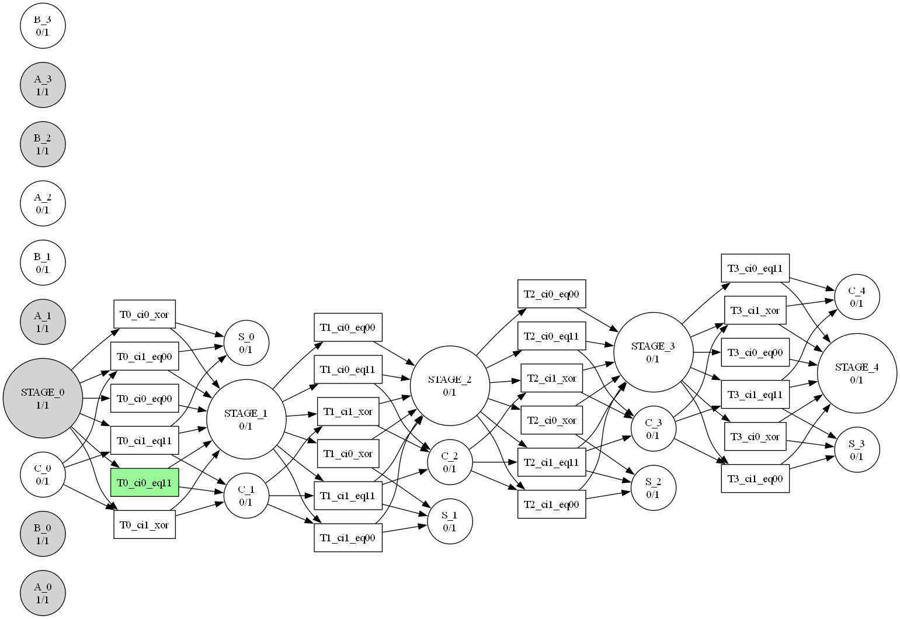
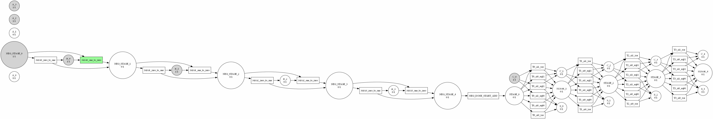
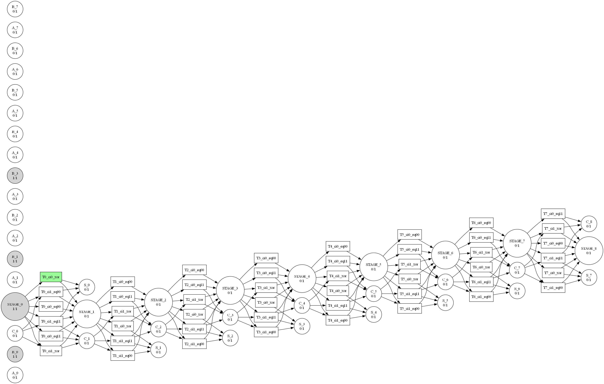
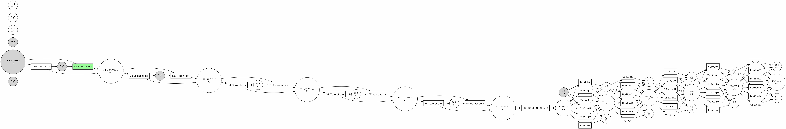

## ⚙️ Modelado de Operaciones Aritméticas Binarias mediante Redes de Petri

Trabajo Práctico Final — Seminario de Programación Concurrente, Paralela y Distribuida (UNSAM, 2°C - 2025).

Este proyecto propone diseñar y analizar redes de Petri que modelen las operaciones aritméticas binarias básicas: suma, resta, multiplicación y división. Además incluye un simulador en Python, constructores de redes para cada operación y una suite de pruebas reproducible.

---

## 👥 Integrantes

- Tomás Aragusuku
- Gabriel Tarquini
- Agustín Narváez
- Melody Oviedo Morales

---

## 🎯 Objetivo

Modelar y ejecutar con Redes de Petri (RdP) las cuatro operaciones aritméticas básicas sobre números binarios, con foco en:

- Diseño de redes por operación (concurrencia y sincronización).
- Comprobación de propiedades: alcanzabilidad, acotación y vivacidad.
- Implementación de un motor RdP en Python y constructores por operación.
- Casos de prueba reproducibles y trazas de ejecución.

---

## 📚 Resumen teórico (breve)

Una Red de Petri está compuesta por lugares (places), transiciones y arcos dirigidos. Formalmente R = (P, T, I, O). Un marcado M: P → N asigna tokens a los lugares. Una transición está habilitada si sus lugares de entrada disponen de tokens suficientes; al disparar consume y produce tokens según I y O.

Propiedades a validar:

- Acotación: p. ej. 1-acotada (safe) — cada plaza tiene 0 o 1 tokens.
- Vivacidad: desde cualquier marca alcanzable, cada transición puede habilitarse mediante alguna secuencia (sin deadlocks irreparables).
- Alcanzabilidad / coverability: verificar que marcas objetivo (resultados) son alcanzables.

> Nota: en anexos se pueden incluir teoremas y notación pre/post, SM/MG y persistencia si se requiere.

---

## 🔢 Representación binaria dentro de la RdP

- Cada bit i de un operando X se representa con una plaza `X_i`. Token presente ⇒ bit = 1. (Ausencia ⇒ 0).
- Acarreos/borrows: plazas `Carry_i`, `Borrow_i` (1-acotadas).
- Salidas: `S_i` (suma), `D_i` (diferencia), `ACC_i` (acumulador), `Q_i`, `R_i` (cociente/resto).

Empezamos manteniendo la red 1-acotada para facilitar pruebas y análisis.

---

## 🛠️ Diseño por operación (resumen)

### ➕ Suma binaria (ripple-carry)

Para cada bit i se modelan transiciones que consumen (A_i, B_i, Carry_i) y producen (S_i, Carry_{i+1}) según la tabla de verdad del full-adder. Se puede implementar con transiciones que cubran las combinaciones necesarias. Opcionalmente, introducir sincronización por etapas para controlar la propagación de carry.

Propiedades esperadas: 1-acotada y viva para entradas finitas.

### ➖ Resta binaria

DOS enfoques:

- Ripple-borrow: análogo a la suma, usando `Borrow_i`.
- Complemento a dos: invertir bits de B, inyectar carry inicial = 1 y reutilizar el sumador (reduce complejidad y facilita tests).

### ✖️ Multiplicación (shift-and-add)

- Escanear bits de B; si `b_i = 1` disparar una suma parcial de A desplazada i posiciones sobre el acumulador `ACC`.
- Permite paralelismo parcial si se controla la sincronización sobre `ACC`.

### ➗ División (resta repetida / algoritmo restaurador)

- Mantener `Q` y `R`. Repetir: si `R >= B` restar B de R e incrementar Q; sino, terminar.
- Requiere un mecanismo de comparación `R_ge_B` que habilite la transición de resta.

---

## ✅ Validación y pruebas

1) Árbol de alcanzabilidad / coverability para operandos pequeños.
2) Aserciones de 1-acotación (tokens ∈ {0,1}).
3) Propiedades de vivacidad (no deadlocks en ejecuciones válidas).
4) Decodificar plazas de salida y comparar con la operación aritmética estándar de Python.

Pruebas unitarias planificadas por operación (casos edge incluidos): overflow, A < B, multiplicación por 0/1, división exacta y con resto.

---

## 📁 Arquitectura propuesta del repositorio

```bash
README.md
src/
  petri/
    place.py        # Place(nombre, capacity=1)
    transition.py   # Transition(inputs, outputs, guard=None)
    net.py          # PetriNet(enabled, fire, step)
    analyzer.py     # alcanzabilidad, acotación, vivacidad
  arith/
    adder.py        # build_adder(n_bits)
    subtractor.py   # build_subtractor(n_bits, mode='borrow'|'two_complement')
    multiplier.py   # build_multiplier(n_bits)
    divider.py      # build_divider(n_bits)
  demo/
    main.py         # CLI: add|sub|mul|div
tests/
  test_adder.py
  test_subtractor.py
  test_multiplier.py
  test_divider.py
```

---

## ▶️ Cómo ejecutar

### 🔹 Modo básico (solo consola)

Requiere Python 3.10+ y ejecutarse desde la raíz del repositorio. Cada comando imprime el resultado en texto:

```powershell
# Suma (4 bits): 0b1011 + 0b0101 → 0b10000
python -m src.demo.main add --bits 4 --A 0b1011 --B 0b0101

# Resta (4 bits) usando complemento a dos
python -m src.demo.main sub --bits 4 --A 0b1100 --B 0b0011 --mode two_complement

# Multiplicación (4 bits)
python -m src.demo.main mul --bits 4 --A 0b1011 --B 0b0011

# División (4 bits): devuelve cociente (Q) y resto (R)
python -m src.demo.main div --bits 4 --A 0b1110 --B 0b0011
```

### 🔹 Modo con visualización (GIF)

Si además querés obtener la secuencia de disparos en formato GIF, usá el visualizador. Genera una carpeta con los fotogramas (`.png`) y un GIF animado por operación:

```powershell
# Suma con visualización (crea out/add_11_5_b4.gif)
python -m scripts.visualize add --bits 4 --A 0b1011 --B 0b0101 --outdir out

# Resta (crea out/sub_12_3_b4.gif)
python -m scripts.visualize sub --bits 4 --A 0b1100 --B 0b0011 --outdir out

# Multiplicación (crea out/mul_11_3_b4_step*.gif por cada suma parcial)
python -m scripts.visualize mul --bits 4 --A 0b1011 --B 0b0011 --outdir out

# División (crea out/div_14_3_b4_step*.gif por cada resta aceptada)
python -m scripts.visualize div --bits 4 --A 0b1110 --B 0b0011 --outdir out
```

> `--outdir` es opcional (por defecto `out/`). Podés usar `--prefix` para personalizar el nombre base de los archivos generados.

### 🎞️ Ejemplos de ejecuciones

| Operación | GIF |
| --- | --- |
| Suma (`0b1011 + 0b0101`) |  |
| Resta (`0b1100 - 0b0011`) |  |
| Multiplicación (`0b1011 × 0b0011`, paso 0) |  |
| Multiplicación (`0b1011 × 0b0011`, paso 1) |  |
| División (`0b1110 ÷ 0b0011`, resta aceptada 0) |  |

---

## 🧪 Estrategia de pruebas y validación

- Tests unitarios para cada operación (happy path + edge cases).
- Generación de árboles de alcanzabilidad para operandos pequeños.
- Aserciones automáticas de 1-acotación y decodificación de resultados.

---

## 📎 Requisitos

- Python 3.10+
- Sin dependencias externas obligatorias (opcional: graphviz para visualización).

---

## ✍️ Créditos y bibliografía

- Apuntes y material de cátedra de Redes de Petri (Campus Virtual UNSAM).
- Murata, Peterson, Reisig & Rozenberg (referencias clásicas sobre RdP).

---
